# LCEII
Repositório criado para a disciplina de Laboratório de Circuitos Elétricos II

Na primeira semana, houve a apresentação da disciplina.

Na segunda semana, criamos gráficos para sinais no domínio do tempo e no domínio fasorial.
  O gráfico no domínio do tempo apresentava uma tensão e uma corrente com um certo atraso em relação à tal tensão.
  O gráfico no domínio fasorial apresentava a tensão e a corrente (ampliada para melhor visualização) no plano complexo.
  
  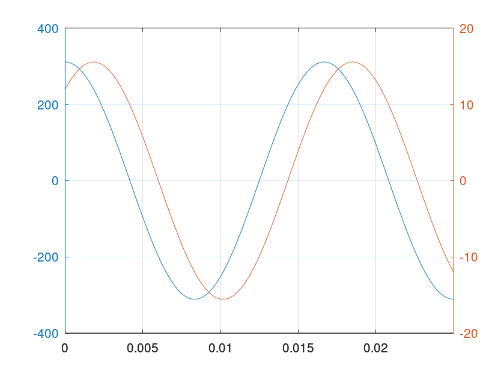
  

Na terceira semana, criamos gráficos para o triângulo das potências, além dos gráficos citados anteriormente.
  O gráfico do triângulo das potências apresenta a Potência ativa, Potência reativa e a Potência aparente no plano complexo.
  Fizemos o gráfico no domínio do tempo, domínio fasorial e triângulo das potências antes e depois do desligamento de uma fonte de 2000W.

  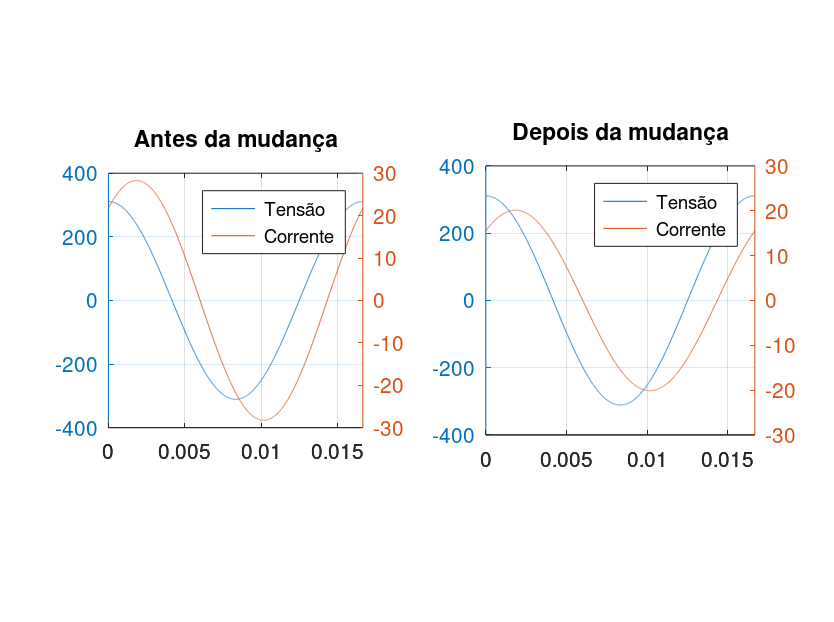
  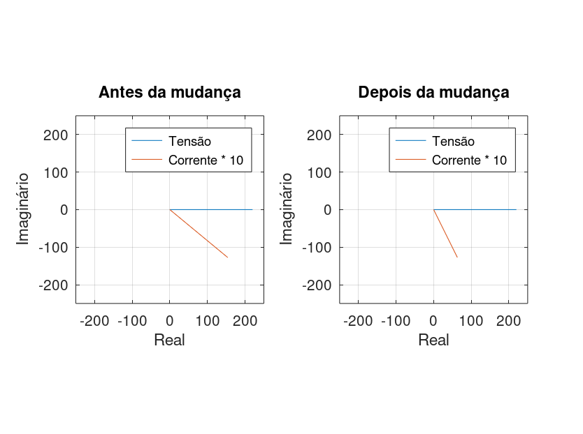
  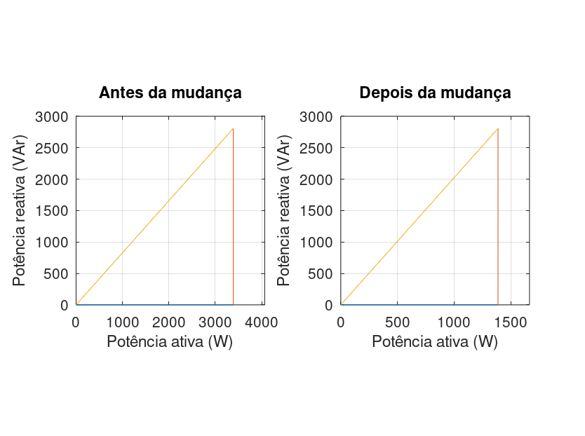

Na quarta semana, fomos apresentados ao efeito da potência reativa na alimentação de uma carga, assim como ao fator de potência.
  Os gráficos mostram os triângulos das potências das cargas conectadas na fonte, antes e depois da compensação feita utilizando o capacitor de menor capacitância, assim como os fatores de potência antes e depois da compensação.
  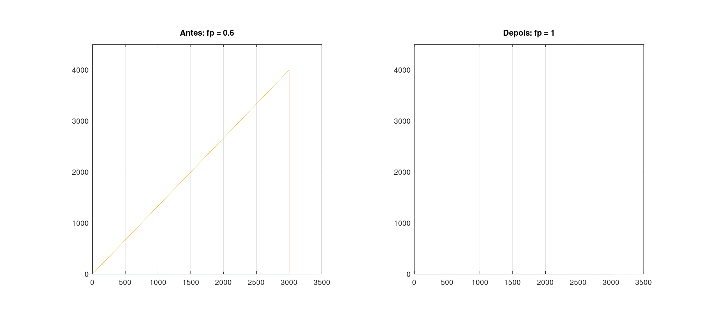
  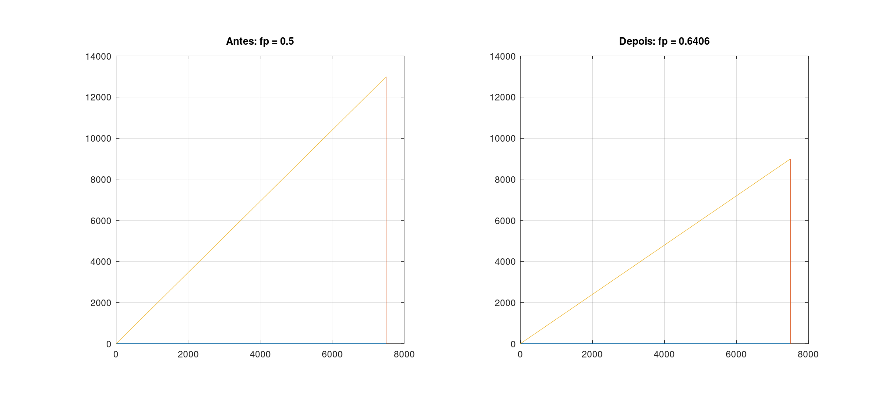
  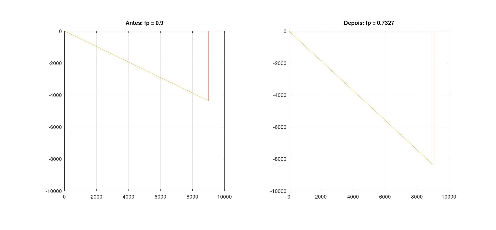
  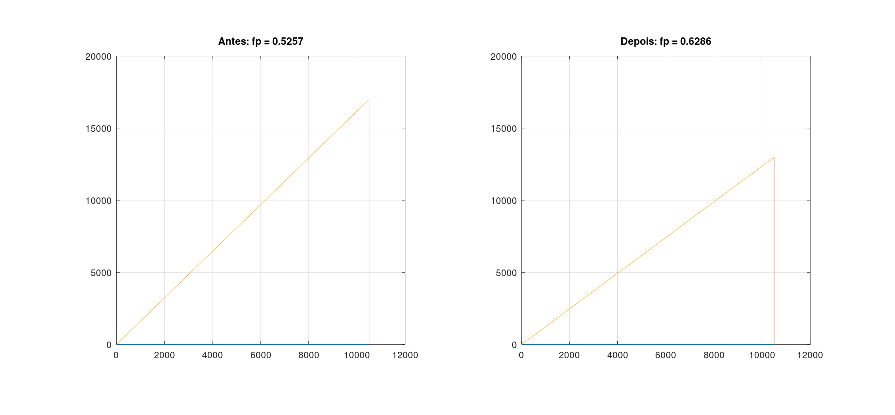
  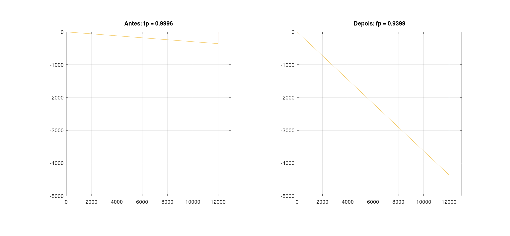
  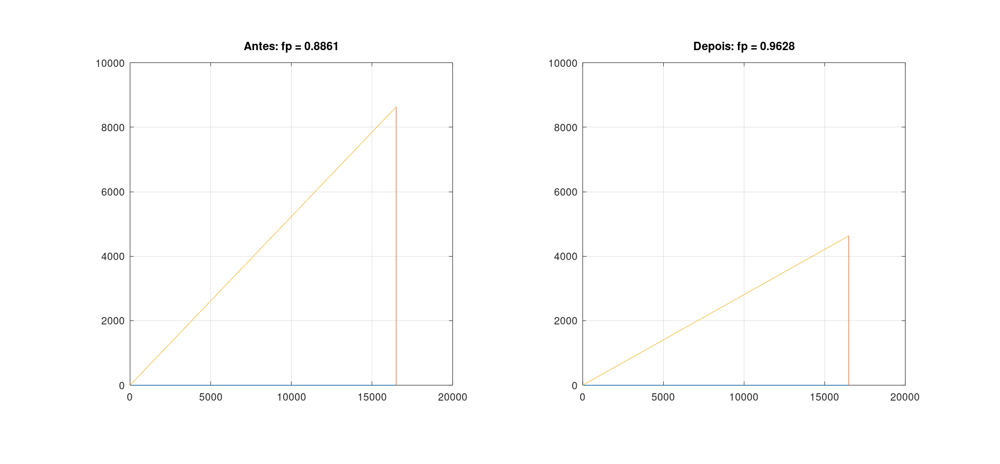
  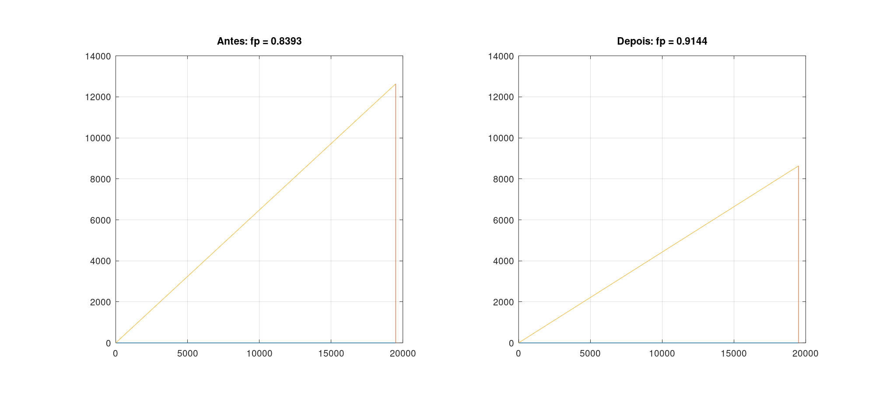